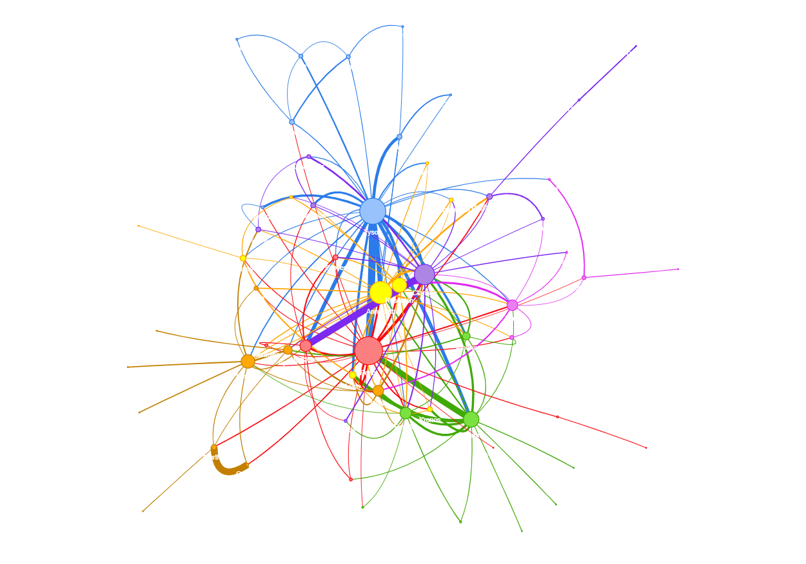

# Extracting relationships between Percy Jackson characters

Over the course of multiple books written by Rick Riordan, the characters in the fantasy novel series 'Percy Jackson and the Olympians' have hade several interactions with one another. These interactions or relationships could be had over multiple characters and not necessarily be linear in nature. Hence a graph of these characters would be a useful tool in showcasing how each character is related to another.

This project is divided into two main parts:
* Data scraping using Selenium
* Data Analysis using Networkx and Pyvis.

The data was scraped from the [Percy Jackson Wiki](https://riordan.fandom.com/wiki/Category:Percy_Jackson_and_the_Olympians_characters), and can be found in [Books/characters.csv](pj_wiki_scraping/Books/characters.csv)

This data was then transformed into a edgelist dataframe, consisting of a source, target and weight of the edge between the source and target, forming a weighted graph. The dataframe was then converted to a graph using the networkx library and further refined using pyvis for graph visualization. The community library was used to cluster the nodes of the graph into their respective groups or communities, based on the characters of the books. Furthermore, there are some statistical graphs that show the trends of main characters over the course of the five books. 

What the graphs look like:

*Note: The scraping is only possible on Chrome for now.* 

To do:
* resize graph
* hide long outputs
* add note to open in nbViewer
